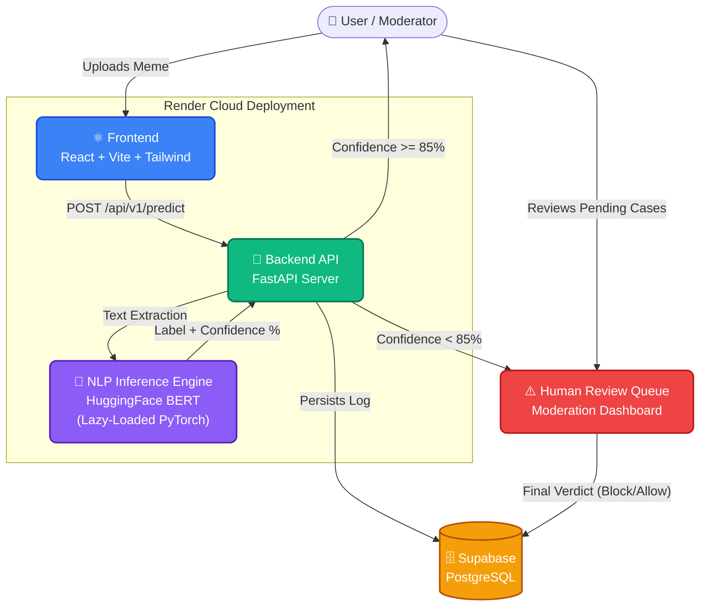

<div align="center">
  
  
  
  
  

  <h1>🛡️ MemeGuard — Harmful Meme Detection System</h1>
  <p><i>A full-stack, AI-powered platform designed to detect, flag, and manage harmful or offensive multimodal content using state-of-the-art NLP models.</i></p>

  <p>
    <a href="https://memeguard-frontend.onrender.com/"></a>
    <a href="https://memeguard-backend.onrender.com/docs"></a>
  </p>
</div>

---

## 🏗️ Architecture & Workflow

The system is built on a modern **React/Vite** frontend and a **FastAPI** Python backend, backed by **Supabase PostgreSQL**. The core engine features a real-time NLP classification pipeline powered by a fine-tuned **BERT** model.



---

## 🌟 Key Features

- **⚡ High-Performance Backend**: Built with **FastAPI** for asynchronous, high-throughput request handling. Includes dual-stream deployment telemetry.
- **🧠 Real-Time NLP Inference**: Integrated with a fine-tuned HuggingFace BERT model (`autonlp-text-hateful-memes`). Designed with a **Lazy-Load Singleton** architecture to safely run PyTorch ML models within strict 512MB RAM cloud constraints.
- **🎨 Dynamic Frontend**: Responsive, glassmorphism-inspired animated UI built with **React**, **Vite**, and **Tailwind CSS**.
- **🗄️ Self-Evolving Schema**: Managed via **Alembic ORM Migrations** directly connected to a **Supabase PostgreSQL** cloud instance.
- **⚖️ Intelligent Moderation Router**: Configurable confidence thresholds automatically route borderline or ambiguous memes to a dedicated **Human Review Queue**.

---

## 📁 Repository Structure

```text
meme-detection/
├── 📂 backend/               # FastAPI server, PyTorch Inference, DB migrations
│   ├── 📂 app/               # Application core (routers, schemas, services)
│   ├── 📂 migrations/        # Alembic revision scripts
│   ├── 📄 requirements.txt   # CPU-optimized pinned dependencies
│   └── 📄 .env               # Secrets (Not tracked)
├── 📂 frontend/              # React application
│   ├── 📂 src/               # React components, pages, context
│   ├── 📄 package.json       # Node dependencies
│   └── 📄 tailwind.config.js # Theming and Design Tokens
├── 📄 deploy.sh              # Production-grade CI/CD pre-deployment orchestrator
└── 📄 README.md              # You are here!
```

---

## 🚀 Quick Start Guide

### 1. Database & Backend Setup

```bash
cd backend
# Create and activate a virtual environment
python -m venv .venv
source .venv/bin/activate   # Linux/macOS
# .venv\Scripts\activate    # Windows

# Install CPU-optimized dependencies
pip install -r requirements.txt

# Run migrations to set up Supabase schema
alembic upgrade head

# Start FastAPI server
uvicorn app.main:app --reload --port 8000
```
> **Tip:** API Docs available at `http://localhost:8000/docs`

### 2. Frontend Setup

```bash
cd frontend
# Install dependencies
npm install

# Start development server
npm run dev
```
> **Tip:** Web App available at `http://localhost:5173`

---

## 🛣️ Project Roadmap

- [x] **Phase 1**: Full-stack setup, Supabase migrations, React UI, and Human Moderator Queue.
- [x] **Phase 1.5**: **BERT NLP Integration**. Replaced mock inference with real PyTorch classification, including Render free-tier deployment optimizations (lazy-loading, CPU wheels, CVE patches).
- [ ] **Phase 2**: Integration of **CLIP** and **BLIP-2** for multi-modal vision-language analysis (understanding the image *context* alongside text).
- [ ] **Phase 3**: Explainable AI (**Grad-CAM heatmaps**) and EasyOCR text extraction.

---
<div align="center">
  <i>Built for safe, scalable, and intelligent content moderation.</i>
</div>
